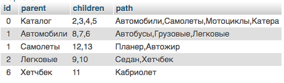

## Хранение дерева в базе данных

Есть таблица в MySQL, наполненная вымышленными связями:

```sql
DROP TABLE category;
CREATE TABLE `category` (
 `id` int(11) NOT NULL AUTO_INCREMENT,
 `parent_category_id` int(11) NOT NULL,
 `name` varchar(100) COLLATE utf8_unicode_ci NOT NULL,
 PRIMARY KEY (`id`),
 UNIQUE KEY `unique_key` (`id`,`parent_category_id`),
 KEY `parent_category_id` (`parent_category_id`)
) ENGINE=InnoDB DEFAULT CHARSET=utf8 COLLATE=utf8_unicode_ci;

INSERT INTO `category` (`id`, `parent_category_id`, `name`) VALUES
(1, 0, 'Каталог'),
(2, 1, 'Автомобили'),
(3, 1, 'Самолеты'),
(4, 1, 'Мотоциклы'),
(5, 1, 'Катера'),
(6, 2, 'Легковые'),
(7, 2, 'Грузовые'),
(8, 2, 'Автобусы'),
(9, 6, 'Седан'),
(10, 6, 'Хетчбек'),
(11, 10, 'Кабриолет'),
(12, 3, 'Планер'),
(13, 3, 'Автожир'),
(14, 11, 'Soft Top'),
(15, 11, 'Hard Top');
```

Так данные могут выглядеть на HTML странице:


Для выборки дерева из БД можно применять различные подходы. Как показала практика - все зависит от размера данных и внутренних правил организации (предприятия). 

Самое простое решение - оно же самое не эффективное. Рекурсивная выборка нод «потомков» по ID ноды (начиная с 0 - корень дерева).

Ее разновидность - та же самая рекурсивная выборка, но выполняемая на стороне БД (оформленная в виде процедуры). Как побочный эффект - лишняя нагрузка на сервер БД.

В нескольких проектах я использовал рекурсивное построение дерева из плоского списка всех нод средствами PHP (при гарантированно ограниченном количестве нод - контролируемое дерево разделов/страниц сайта).

Как вариант - пересмотреть подход. Подгружать потомков ноды по требованию (заодно подтвердить подход YAGNI).


#### Варианты решения простых задач

Выборка всех категорий для последующего построения дерева (см. [public/tree.php](public/tree.php)):

```sql
SELECT
   parent_category_id id,
   (
      SELECT
         name 
      FROM
         category 
      WHERE
         id = c.parent_category_id
   )
   parent,
   GROUP_CONCAT(c.id) children,
   GROUP_CONCAT(c.name) path 
FROM
   category c 
WHERE
   c.parent_category_id > 0 
GROUP BY
   c.parent_category_id
```




Выборка всех категорий верхнего уровня, начинающихся на “авто”:

```sql
SELECT
    * 
 FROM
    (
       SELECT
          parent_category_id,
          GROUP_CONCAT(id) children,
          COUNT(id) cnt,
          name 
       FROM
          category 
       GROUP BY
          parent_category_id
    )
    cats 
 WHERE
    cnt > 1 
    AND name LIKE 'авто%'
```


Выборка всех категорий, имеющих не более трёх подкатегорий следующего уровня (без глубины):

```sql
SELECT
   * 
FROM
   (
      SELECT
         parent_category_id,
         GROUP_CONCAT(id) children,
         COUNT(id) cnt 
      FROM
         ` category ` 
      GROUP BY
         parent_category_id
   )
   cats 
WHERE
   cnt < 3
```


Выборка всех категорий нижнего уровня (т.е. не имеющих детей):

```sql
SELECT
   * 
FROM
   category 
WHERE
   id NOT IN 
   (
      SELECT
         parent_category_id 
      FROM
         category 
      GROUP BY
         parent_category_id 
   )
```

