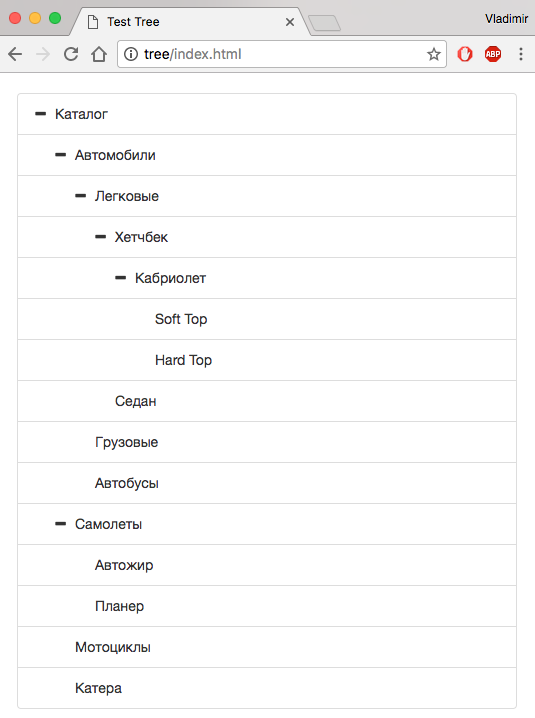
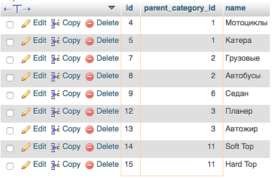

## Хранение дерева в базе данных

Есть таблица в MySQL, наполненная тестовыми данными:

```sql
DROP TABLE category;
CREATE TABLE category (
    id INT NOT NULL,
    parent_category_id INT NOT NULL,
    name varchar(100) not null,
    PRIMARY KEY (id),
    UNIQUE unique_key (id, parent_category_id)
);

INSERT INTO `category` (`id`, `parent_category_id`, `name`) VALUES
(1, 0, 'Автомобили'),
(2, 0, 'Самолеты'),
(3, 0, 'Мотоциклы'),
(4, 0, 'Катера'),
(5, 1, 'Легковые'),
(6, 1, 'Грузовые'),
(7, 1, 'Автобусы'),
(8, 5, 'Седан'),
(9, 5, 'Хетчбек'),
(10, 9, 'Кабриолет'),
(11, 2, 'Планер'),
(12, 2, 'Автожир');

```
Используемые ключи описаны в структуре таблицы.

Так данные могут выглядеть на HTML странице:




Для выборки дерева из БД можно применять различные подходы. Как показала практика - все зависит от размера данных и внутренних правил организации (предприятия). 

Самое простое решение - оно же самое не эффективное. Рекурсивная выборка нод «потомков» по ID ноды (начиная с 0 - корень дерева).

Ее разновидность - та же самая рекурсивная выборка, но выполняемая на стороне БД (оформленная в виде процедуры). Как побочный эффект - лишняя нагрузка на сервер БД.

В нескольких проектах я использовал рекурсивное построение дерева из плоского списка всех нод средствами PHP (при гарантированно ограниченном количестве нод - контролируемое дерево разделов/страниц сайта).

Как вариант - пересмотреть подход. Подгружать потомков ноды по требованию (заодно подтвердить подход YAGNI).


#### Варианты решения простых задач

Выборка всех категорий верхнего уровня, начинающихся на “авто”:

```sql
SELECT * FROM (
  SELECT parent_category_id, GROUP_CONCAT(id) children, COUNT(id) cnt, name 
  FROM `category` 
  GROUP BY parent_category_id) cats 
WHERE cnt>1 AND name LIKE 'авто%’;
```


Выборка всех категорий, имеющих не более трёх подкатегорий следующего уровня (без глубины):

```sql
SELECT * FROM (
  SELECT parent_category_id, GROUP_CONCAT(id) children, COUNT(id) cnt 
  FROM `category` GROUP BY parent_category_id) cats 
WHERE cnt<3;
```


Выборка всех категорий нижнего уровня (т.е. не имеющих детей):

```sql
SELECT * FROM category 
WHERE id NOT IN (
  SELECT parent_category_id 
  FROM `category` 
  GROUP BY parent_category_id
);
```


Поле `children` выводится для примера и может быть использовано для рекурсивных операций.

