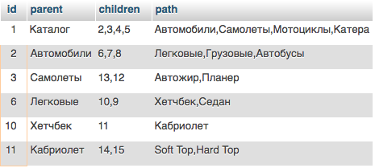
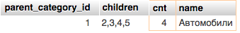

## CSS

```html
    <style>
        table .c { color: red }
        .a .c { color: green }
    </style>

    <table id="t">
        <tr>
            <td class="c">Текст</td>
        </tr>
    </table>
```
Переключение цвета текста в зеленый:

**DOM query**

document.getElementById('t').setAttribute('class', 'a');

**jQuery:**

$('#t').attr('class', 'a');

$('#t').toggleClass('a');

## Поиск палиндрома

```php
<?php
/**
 * Created by PhpStorm.
 * User: wlady2001
 * Date: 23.11.16
 * Time: 12:51
 */

$origin = 'Sum summus mus';

$str = strtolower(str_replace(' ', '', $origin));
$len = strlen($str);
if ($len % 2) {
    $str1 = substr($str, 0, $len/2);
    $str2 = strrev(substr($str, $len/2+1));
} else {
    list($str1, $str2) = str_split($str, $len/2);
    $str2 = strrev($str2);
}
if ($str1==$str2) {
    echo 'String is palindrome: ', $origin, "\n";
    exit;
}

$longest = '';
$len = strlen($origin);
for ($i=0; $i<$len; $i++) {
    for ($j=1; $j<$len-$i+1; $j++) {
        $find = substr($origin, $i, $j);
        $tmp = strrev($find);
        if (preg_match("/{$tmp}/i", $origin)) {
            if (strlen($longest)<strlen($find)) {
                $longest = $find;
            }
        }
    }
}
if (strlen($longest)>3) {
    echo 'The longest palindrome substring: ', $longest, "\n";
    exit;
}

echo 'String is not a palindrome: ', $origin[0], "\n";
```

## Хранение дерева в базе данных

Есть таблица в MySQL, наполненная тестовыми данными:

```sql
DROP TABLE category;
CREATE TABLE category (
    id INT NOT NULL,
    parent_category_id INT NOT NULL,
    name varchar(100) not null,
    PRIMARY KEY (id),
    UNIQUE unique_key (id, parent_category_id)
);

INSERT INTO `category` (`id`, `parent_category_id`, `name`) VALUES
(1, 0, 'Каталог'),
(2, 1, 'Автомобили'),
(3, 1, 'Самолеты'),
(4, 1, 'Мотоциклы'),
(5, 1, 'Катера'),
(6, 2, 'Легковые'),
(7, 2, 'Грузовые'),
(8, 2, 'Автобусы'),
(9, 6, 'Седан'),
(10, 6, 'Хетчбек'),
(11, 10, 'Кабриолет'),
(12, 3, 'Планер'),
(13, 3, 'Автожир');

```
Используемые ключи описаны в структуре таблицы.

Так данные могут выглядеть на HTML странице:


Для выборки дерева из БД можно применять различные подходы. Как показала практика - все зависит от размера данных и внутренних правил организации (предприятия). 

Самое простое решение - оно же самое не эффективное. Рекурсивная выборка нод «потомков» по ID ноды (начиная с 0 - корень дерева).

Ее разновидность - та же самая рекурсивная выборка, но выполняемая на стороне БД (оформленная в виде процедуры). Как побочный эффект - лишняя нагрузка на сервер БД.

В нескольких проектах я использовал рекурсивное построение дерева из плоского списка всех нод средствами PHP (при гарантированно ограниченном количестве нод - контролируемое дерево разделов/страниц сайта).

Как вариант - пересмотреть подход. Подгружать потомков ноды по требованию (заодно подтвердить подход YAGNI).


#### Варианты решения простых задач

Выборка всех категорий для последующего построения дерева:

```sql
SELECT
(
   SELECT
      parent_category_id 
   FROM
      category 
   WHERE
      id = c.parent_category_id) id,
      (
         SELECT
            name 
         FROM
            category 
         WHERE
            id = c.parent_category_id
      )
      parent,
      GROUP_CONCAT(c.id) ids,
      GROUP_CONCAT(c.name) path 
   FROM
      category c 
   WHERE
      c.parent_category_id > 0 
   GROUP BY
      c.parent_category_id
```




Выборка всех категорий верхнего уровня, начинающихся на “авто”:

```sql
SSELECT
    * 
 FROM
    (
       SELECT
          parent_category_id,
          GROUP_CONCAT(id) children,
          COUNT(id) cnt,
          name 
       FROM
          category 
       GROUP BY
          parent_category_id
    )
    cats 
 WHERE
    cnt > 1 
    AND name LIKE 'авто%'
```


Выборка всех категорий, имеющих не более трёх подкатегорий следующего уровня (без глубины):

```sql
SELECT
   * 
FROM
   (
      SELECT
         parent_category_id,
         GROUP_CONCAT(id) children,
         COUNT(id) cnt 
      FROM
         ` category ` 
      GROUP BY
         parent_category_id
   )
   cats 
WHERE
   cnt < 3
```


Выборка всех категорий нижнего уровня (т.е. не имеющих детей):

```sql
SELECT
   * 
FROM
   category 
WHERE
   id NOT IN 
   (
      SELECT
         parent_category_id 
      FROM
         category 
      GROUP BY
         parent_category_id 
   )
```


Поле `children` выводится для примера и может быть использовано для рекурсивных операций.

